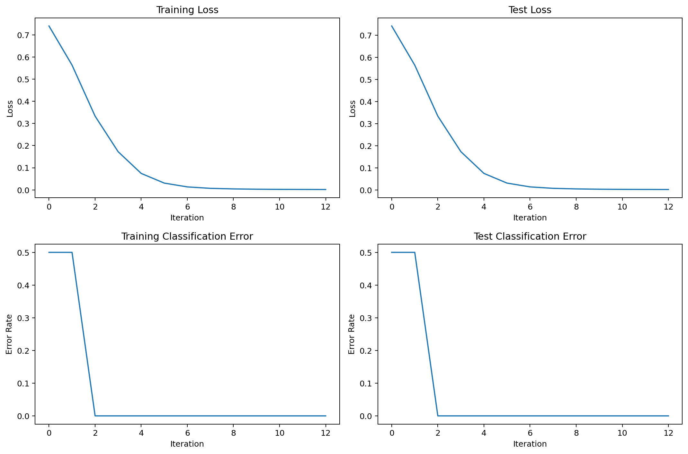
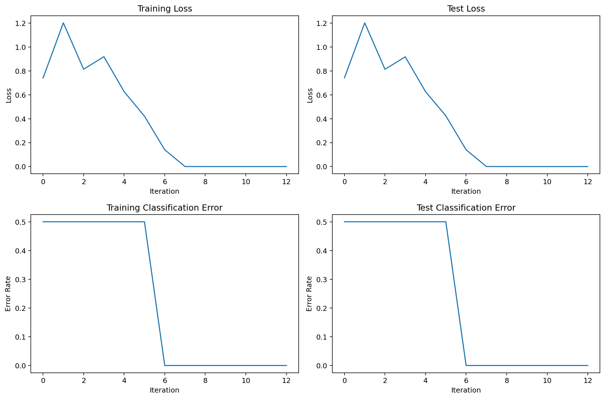
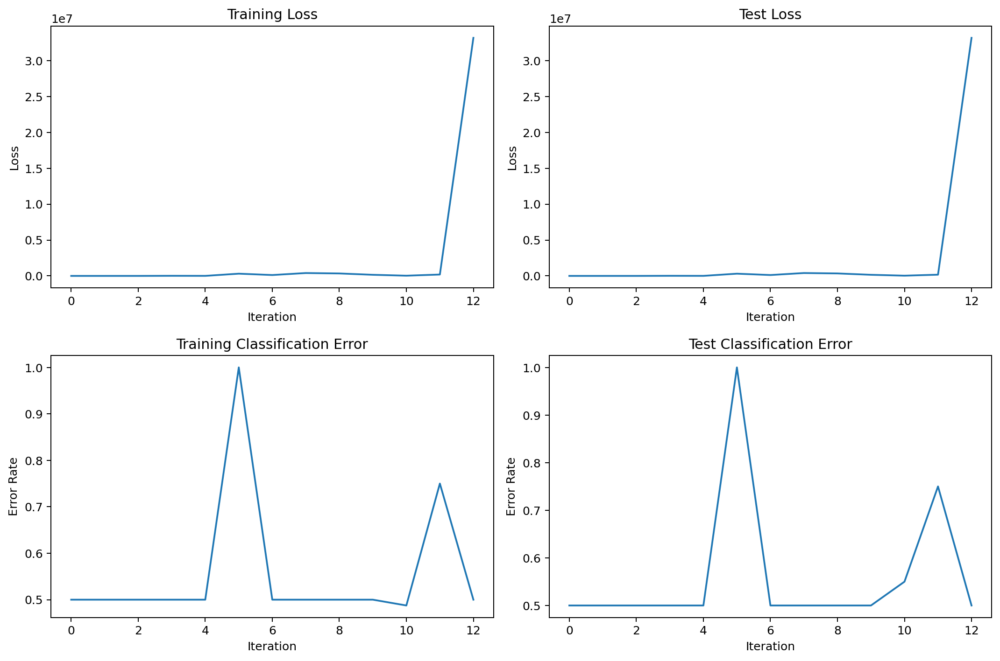
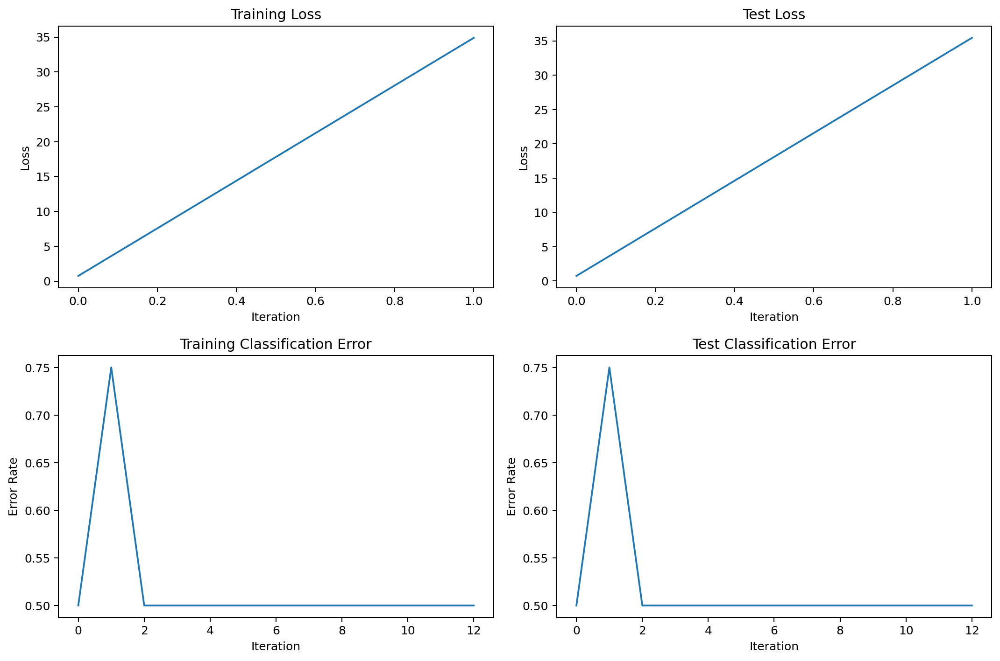

## 1.Expansion Experiments on Text Task

The formal results are conducted on the GLUE SST-2 sentimental classification dataset using pretrained DistilBert-base model with a single Nvidia A100 GPU.

Under the optimal hyper-parameter sweep, results of Table 1 are repeatedly run two times for 80 epochs and 32 batch size, and take the averaged best test accuracy within two times run. The values of accuracy are reported with standard variance float. Per-epoch wall-clock time is reported as epoch averaged value with standard variance.

**Table 1. Comparison results on SST-2 with DistilBert-base.**

| Optimizer / Results |     Test Accuracy(%)      | Averaged Wall-Clock Time(s) |
| :-----------------: | :-----------------------: | :-------------------------: |
|        AdamW        |   91.06(+-0.16)   |   214.06(+-18.25)   |
|         SGD         |   90.65(+-0.08)   | **197.28(+-8.26)**  |
|        K-FAC        |   91.04(+-0.14)   |   385.61(+-21.76)   |
|        D-NGD        | **91.34(+-0.08)** |   215.04(+-11.06)   |

The hyper-parameter settings in Table 1 are selected by the following sweep protocols. Corresponding sweep data is in the project path of ""\logs\distilbert_sst2\sweep".

Each sweep run used a batch size of 32 and was conducted for 20 epochs on a single Nvidia A100 GPU:

- For AdamW, the sweep covered learning rates $\eta = \{3e-3,3e-4,3e-5,3e-6\}$, $(\beta_1,\beta_2)=\{(0.5, 0.55),(0.7,0.77),(0.9,0.99)\}$, and $\epsilon = \{1e-1,1e-2,1e-3,1e-4\}$. 

- For SGD, the sweep considered learning rates $\eta = \{3e-3,3e-4,3e-5,3e-6\}$ and $momentum = \{0.3,0.6,0.9\}$. 

- For K-FAC, the sweep considered learning rates $\eta = \{3e-3,3e-4,3e-5,3e-6\}$ and $momentum = \{0.3,0.6,0.9\}$ and damping $\rho = \{1e-1,1e-2,1e-3,1e-4\}$.

- For DNGD, the sweep examined learning rates  $\eta = \{3e-3,3e-4,3e-5,3e-6\}$, damping $\rho = \{3e-1,3e-2,3e-3,3e-4,3e-5,6e-1,6e-2,6e-3,6e-4,6e-5\}$, and $momentum = \{0.3,0.6,0.9\}$.

**Table 2. Hyper-parameter sweep results**.

| Optimizer / Results |                   Optimal Hyper Parameters                   | Best Test Loss | Best Test Accuracy(%) |
| :-----------------: | :----------------------------------------------------------: | :------------: | :-------------------: |
|        AdamW        | $\eta=3e-5$, $(\beta_1,\beta_2)=(0.9.0.99)$, $\epsilon=1e-3$ |    0.36005     |         91.17         |
|         SGD         |                 $\eta=3e-4$, $momentum=0.9$                  |    0.36443     |         90.37         |
|        K-FAC        |            $\eta=3e-4$ $momentum=0.9$ $\rho=1e-1$            |    0.36720     |         90.97         |
|        D-NGD        |          $\rho=6e-4$, $\eta= 3e-5$,  $momentum=0.6$          |    0.35705     |       **91.74**       |

For AdamW, we conducted a weight decay sweep on $\{5e-1,5e-2,5e-3,5e-4,5e-5,5e-6\}$ after the optimal value of $\eta=3e-4$, $(\beta_1,\beta_2)=(0.9.0.99)$ and $\epsilon=1e-3$ was determined. The optimal value of weight decay for AdamW takes $5e-4$ as the following table shows. Similar optimal weight decay settings are also observed on other optimizers and therefore we set $weight\_decay=5e-4$ for SGD, D-NGD and K-FAC.

**Table 3. Weight decay sweep of AdamW.**

| Weight Decay Grid | Best Test Loss | Best Test Accuracy(%) |
| :---------------: | :------------: | :-------------------: |
|      $5e-1$       |    0.35329     |         91.15         |
|      $5e-2$       |    0.35263     |         90.60         |
|      $5e-3$       |    0.35800     |         90.83         |
|      $5e-4$       |    0.35606     |       **91.17**       |
|      $5e-5$       |    0.34906     |         90.60         |
|      $5e-6$       |    0.35816     |         91.06         |

## 2. Ablation Studies of $\rho$

We run the ablation studies of damping term $\rho$ to verify its role of controlling the lower bound of generalization error in Corollary 5.3 and improving numerical stability. Dataset and model are GLUE SST-2 and DistilBert-base. Results are reported with best test accuracy 

We consider four cases in ablation studies, and other parameters of D-NGD follow the optimal hyper-parameter setting in Table 2:

- $\rho =0,$ i.e., $\rho=0.0$, $\eta= 3e-5$,  $momentum=0.6$;
- $\rho / \eta <2,$ i.e., $\rho=6e-6$, $\eta= 3e-5$,  $momentum=0.6$;
- $\rho / \eta =2,$ i.e., $\rho=6e-5$, $\eta= 3e-5$,  $momentum=0.6$;
- $\rho / \eta > 2$ i.e., $\rho=6e-5$, $\eta= 3e-5$,  $momentum=0.6$.

**Table 4. Ablation Studies of Damping Term**

| Ratio of $\rho / \eta$ / Performance |  Test Loss  | Best Test Accuracy(%) |
| :----------------------------------: | :---------: | :-------------------: |
|          $\rho / \eta = 0$           |     nan     |        49.083         |
|           $\rho / \eta<2 $           |   0.69302   |        50.9174        |
|           $\rho / \eta=2$            |   0.51790   |         82.11         |
|           $\rho / \eta>2$            | **0.40327** |       **91.28**       |

When $\rho = 0$, the error of loss not a number(nan) is triggered by the zero division in computing the vector-jacobian product of inverse diagonal FIM and gradient. The full data of ablation experiment is provided in this project root: "\logs\distilbert_sst2_ablation". 

## 3. Additional Sharpness-Aware Minimization(SAM) Baseline

We add SAM as an additional baseline. This experiments are conducted on GLUE SST-2 and DistilBert-base with a single Nvidia A100 GPU. Each optimizer run two times (32 batch size and 80 epochs) and report with averaged best value and standard variance.

| Optimizer |       Test Accuracy       | Averaged Wall-Clock Time(s) |
| :-------: | :-----------------------: | :-------------------------: |
|    SAM    | **91.69(+-0.07)** |   376.33(+-14.64)   |
|   D-NGD   |   91.34(+-0.08)   | **215.04(+-11.06)** |

D-NGD hyper-parameters are followed by the optimal configuration in Table 1. We implement SAM and use SGD as the base optimizer of SAM. Its radius hyperparameter is configured as the recommended value $0.1$ of the paper [1]. Other parameters are followed by the base optimizer SGD($\eta=3e-4$, $momentum = 0.9$, $weight\_decay = 5e-4$). 

We can observe that, although SAM is not fully optimized in terms of hyperparameters, it can outperform D-NGD in terms of generalization performance. However, the improvement is at the significant increase of wall-clock time. 

[1] Sharpness-Aware Minimization for Efficiently Improving Generalization, Pierre Foret, et al., ICLR 2021.

## 4. Training a Transformer from Scratch

For a fast reproduction of results in this section, one can use the code book in this project's root:"scratch_text_transformer.ipynb". 

(1).Training curves provides the comparison results among SGD, AdamW and D-NGD in the following figures.

Compared with AdamW(Figure 2), D-NGD(Figure 1) shows a faster and more stable decrease in terms of loss curve and classification error. Compared with SGD(Figure 3), D-NGD(Figure 1) shows a faster decrease in terms of loss curve.

(2). Ablation studies on $\rho$ are provided in Figure 4, 5, 6, 7 and 8.

We consider five values of $\rho = [0.5,0.2,0.01,0.0001,0.0]$ and fixed $\eta = 0.1$ for D-NGD, as controlling of variables.

As the ratio $\rho / \eta$ decrease, we can observe a clear instable training curves and significant decrease in test accuracy.

-------------------------------

### (1). Training Curves

**Figure 1. The training & test loss curve and error rate of D-NGD on a small Transformer and small text classification.**

**Figure 2. The training & test loss curve and error rate of AdamW on a small Transformer and small text classification.**

**Figure 3. The training & test loss curve and error rate of SGD on a small Transformer and small text classification.**

----------------------------

### (2). Verification of Corollary 5.3 on Training Transformer from Scratch

**Figure 4. D-NGD with $\rho=0.5$ and $\eta=0.1$**.

**Figure 5. D-NGD with $\rho=0.2$ and $\eta=0.1$. A slower decrease in terms of Error Rate, compared with Figure 4($\rho =0.5$ and $\eta =0.1$).**

**Figure 6. D-NGD with $\rho=0.01$ and $\eta=0.1$. Training process becomes instable.**

**Figure 7. D-NGD with $\rho=0.0001$ and $\eta=0.1$. A clear decrease happens in Error Rate compared with Figure 6( $\rho=0.01$ and $\eta=0.1$).**

**Figure 8. D-NGD with $\rho=0.0$ and $\eta=0.1$. Error rate keeps at 50% and a surge shows in training curves.**

